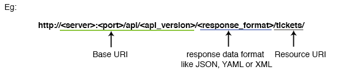

#HappyFox API Technical Reference

The API provided by the Helpdesk is a RESTful web service. It supports operations like creating a ticket, adding updates to a ticket, listing tickets and users of the Helpdesk, etc. It supports JSON, YAML, XML, Form Urlencoded and Multipart Form Data formats.

##Requirements

The API requires following skills in any programming language.

1. Making HTTP requests (using GET and POST HTTP methods as a minimum requirement).

2. Doing HTTP Basic Authentication.

3. Generating and reading data in anyone of the formats-JSON,YAMLorXML.

4. Optionally making HTTP POST requests using content type of "multipart/form-data" (needed for ticket attachments)

##Documentation Conventions

The documentation indicates parameters that need to be replaced with actual values using the format <parameter_name>. The entire string including the enclosing < and > should be replaced.

*For example: if the parameter is &lt;email&gt; it should be replaced with the required email address*

##End Points

* [Tickets](https://github.com/reachvijay/HappyAPI/blob/master/sections/tickets.md)
* [Ticket Category](https://github.com/reachvijay/HappyAPI/blob/master/sections/category.md)
* [Ticket Status](https://github.com/reachvijay/HappyAPI/blob/master/sections/status.md)
* [Ticket Priority](https://github.com/reachvijay/HappyAPI/blob/master/sections/priority.md)
* [Custom Fields](https://github.com/reachvijay/HappyAPI/blob/master/sections/customfields.md)
* [Staff](https://github.com/reachvijay/HappyAPI/blob/master/sections/staff.md)
* [User](https://github.com/reachvijay/HappyAPI/blob/master/sections/user.md)
* [Protocols, Data Formats and Mechanisms](https://github.com/reachvijay/HappyAPI/blob/master/sections/protocols.md)

##Authentication

The API requires a "API Key" and "Auth Code" pair for access. Contact the Helpdesk Admin for access details.

The server uses HTTP Basic Authentication with the "API Key" as username and "Auth Code" as the password. The authentication realm is "API".

The API server returns HTTP response code 401 in case of authorization required or login failure.

####SECURITY NOTES:

* Credentials are passed as plain-text in HTTP Basic Authentication, therefore it is recommended to use SSL/TLS if the API is used over the Internet.
* It is not recommended to invoke the API directly from browser using Javascript as this would require the "API Key" and "Auth Code" to be present on the browser side. Instead the API should be invoked from the web application server.

##API Version
The resources and operations provided by the API will change over time as new features are added or existing features are modified. In order to maintain compatibility between the API clients and server each version of the API has a designated a version string. This string has to be specified as part of all the requests sent to the server. See Resource URIs for details on how to send the version number.

##Resource URIs

The URIs used by the API have a common base URI followed by the response data format and finally followed by the resource or collection URI.

####Base URI

The base URI is composed of the following parts

1. HTTP or HTTPS protocol specifier
2. API server hostname
3. API server port number (optional–defaults to port 80) 
4. API version string

##Throttling

The API server limits the number of requests that can be sent during a interval of time. There are independent limits for read and write operations. Contact the Helpdesk Admin to know the current limits and for changing them to meet requirements.

In case the request limits are exceeded the API server returns HTTP response code 503 along with the time to wait before retrying in the response body.

